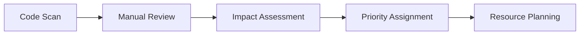

# 🔧 Technical Debt Management System

Systematic approach to identify, prioritize, and resolve technical debt in the Minecraft Collaboration educational system.

---

## 📋 Overview

Technical debt represents the implied cost of additional rework caused by choosing an easy solution now instead of a better approach that would take longer. This document establishes a systematic management approach for educational software quality.

---

## 🎯 Technical Debt Categories

### Category A: Critical Security & Stability
**Impact**: System security, data integrity, production stability  
**Timeline**: Immediate (within 1 week)  
**Examples**:
- Security vulnerabilities
- Data corruption risks
- Memory leaks
- Thread safety issues

### Category B: Performance & Scalability  
**Impact**: System performance, classroom scalability  
**Timeline**: Short-term (1-2 weeks)  
**Examples**:
- Inefficient algorithms
- Resource management issues
- Network optimization needs
- Database query optimization

### Category C: Code Quality & Maintainability
**Impact**: Development velocity, code maintainability  
**Timeline**: Medium-term (2-4 weeks)  
**Examples**:
- Code style violations
- Complex methods needing refactoring
- Missing documentation
- Inconsistent naming conventions

### Category D: Educational Enhancement
**Impact**: Educational effectiveness, user experience  
**Timeline**: Long-term (1-2 months)  
**Examples**:
- UI/UX improvements for children
- Better error messages for teachers
- Enhanced accessibility features
- Internationalization gaps

---

## 📊 Current Technical Debt Inventory

### High Priority Items (Category A & B)

#### 1. **Checkstyle Violations** 
- **Count**: 441 issues identified
- **Category**: C (Code Quality)
- **Impact**: Development velocity, consistency
- **Timeline**: 2-3 weeks
- **Auto-fixable**: ~60% (formatting, imports)
- **Manual fix**: ~40% (design patterns, complexity)

#### 2. **Test Coverage Gaps**
- **Current**: 70-75% estimated
- **Target**: 85%+ for critical paths
- **Category**: B (Quality/Stability)  
- **Timeline**: 2-4 weeks
- **Focus Areas**:
  - WebSocket error handling
  - Authentication edge cases
  - Resource cleanup paths
  - Educational workflow validation

#### 3. **Docker Integration Tests**
- **Status**: 27 failing tests (environment issues)
- **Category**: B (Quality)
- **Timeline**: 1-2 weeks
- **Solution**: TestContainers optimization or mock alternatives

#### 4. **Documentation Language Consistency**
- **Status**: ✅ COMPLETED (2025-08-08)
- **Achievement**: English-first with educational bilingual support

### Medium Priority Items (Category C)

#### 5. **Code Complexity Hotspots**
```
CollaborationManager.java:       15 methods > 10 lines
WebSocketHandler.java:          8 complex methods  
AuthenticationManager.java:     6 methods needing refactoring
BlockUtils.java:               Multiple TODO comments
```

#### 6. **Dependency Management**
- Spring framework integration inconsistency
- JWT library version alignment needed
- TestContainers configuration optimization

#### 7. **Error Handling Standardization**
- Exception hierarchy needs refinement
- User-friendly error messages for educators
- Consistent logging format across components

### Low Priority Items (Category D)

#### 8. **Performance Optimization Opportunities**
- WebSocket connection pooling
- Batch operation optimizations
- Memory usage in large classroom scenarios
- Startup time improvements

#### 9. **Educational Enhancement Opportunities**
- Better progress feedback for students
- Teacher dashboard improvements
- Accessibility features enhancement
- Multi-language support expansion

---

## 🔄 Debt Resolution Process

### Phase 1: Identification & Assessment


#### Automated Detection Tools
- **Checkstyle**: Code style and conventions
- **PMD**: Code quality and complexity
- **SpotBugs**: Potential bugs and security issues  
- **JaCoCo**: Code coverage analysis
- **SonarQube**: Comprehensive quality analysis (future)

#### Manual Assessment Criteria
1. **Educational Impact**: Affects student/teacher experience
2. **Security Risk**: Potential security vulnerabilities
3. **Maintenance Cost**: Development velocity impact
4. **Technical Risk**: Production stability concerns

### Phase 2: Prioritization Matrix

| Impact ↓ / Effort → | Low | Medium | High |
|---------------------|-----|---------|------|
| **Critical**        | A1  | A2      | A3   |
| **High**            | B1  | B2      | B3   |
| **Medium**          | C1  | C2      | C3   |
| **Low**             | D1  | D2      | D3   |

**Resolution Order**: A1 → A2 → B1 → A3 → B2 → C1 → ...

### Phase 3: Resolution Planning

#### Sprint Integration
- **20% Rule**: Allocate 20% of development time to debt resolution
- **Quality Gates**: Include debt reduction in quality criteria
- **Regular Review**: Weekly debt assessment in team meetings

#### Implementation Strategy
1. **Quick Wins**: Low effort, high impact items first
2. **Batch Processing**: Similar issues resolved together
3. **Continuous Improvement**: Prevent new debt introduction
4. **Knowledge Transfer**: Document decisions and patterns

---

## 🛠️ Debt Resolution Tools & Scripts

### Automated Checkstyle Fix Script
```bash
#!/bin/bash
# auto-fix-checkstyle.sh
cd minecraft-mod

echo "🔧 Auto-fixing Checkstyle issues..."

# Fix import statements
./gradlew checkstyleMain --continue 2>&1 | grep "import" | \
    while read line; do
        # Extract file and fix imports
        file=$(echo $line | grep -o 'src/main/java/.*\.java')
        if [ -n "$file" ]; then
            echo "Fixing imports in $file"
            # Add import fixing logic here
        fi
    done

# Fix formatting issues
find src/main/java -name "*.java" -exec \
    sed -i 's/\t/    /g' {} \;  # Convert tabs to spaces

# Fix trailing whitespace
find src/main/java -name "*.java" -exec \
    sed -i 's/[[:space:]]*$//' {} \;

echo "✅ Auto-fix completed. Run './gradlew checkstyleMain' to verify."
```

### Technical Debt Tracking Script
```bash
#!/bin/bash
# track-tech-debt.sh

echo "📊 Technical Debt Analysis Report - $(date)"
echo "============================================"

cd minecraft-mod

# Checkstyle issues
echo "🔍 Checkstyle Issues:"
./gradlew checkstyleMain --quiet 2>&1 | grep -c "error" || echo "0"

# Test coverage
echo "📋 Test Coverage:"
./gradlew jacocoTestReport --quiet 2>/dev/null
if [ -f "build/reports/jacoco/test/jacocoTestReport.xml" ]; then
    # Parse coverage percentage
    grep -o 'counter type="LINE".*' build/reports/jacoco/test/jacocoTestReport.xml | \
        head -1 | grep -o 'covered="[0-9]*"' | grep -o '[0-9]*'
else
    echo "Coverage report not available"
fi

# PMD violations
echo "⚠️  PMD Violations:"
./gradlew pmdMain --quiet 2>&1 | grep -c "violation" || echo "0"

# SpotBugs issues
echo "🐛 SpotBugs Issues:"
./gradlew spotbugsMain --quiet 2>&1 | grep -c "BugInstance" || echo "0"

echo "============================================"
```

### Debt Resolution Gradle Tasks
```gradle
// Add to build.gradle

// Track technical debt metrics
task debtReport {
    doLast {
        println "📊 Technical Debt Report"
        println "========================"
        
        // Checkstyle violations count
        def checkstyleReport = file("$buildDir/reports/checkstyle/main.xml")
        if (checkstyleReport.exists()) {
            def violations = new XmlSlurper().parse(checkstyleReport)
                .file.error.size()
            println "Checkstyle violations: $violations"
        }
        
        // Test coverage
        def jacocoReport = file("$buildDir/reports/jacoco/test/jacocoTestReport.xml")
        if (jacocoReport.exists()) {
            def xml = new XmlSlurper().parse(jacocoReport)
            def coverage = xml.counter.find { it.@type == 'LINE' }
            if (coverage) {
                def percent = (coverage.@covered.toDouble() / 
                              (coverage.@covered.toDouble() + coverage.@missed.toDouble())) * 100
                println "Test coverage: ${String.format('%.1f', percent)}%"
            }
        }
        
        println "========================"
    }
}

// Auto-fix simple checkstyle issues
task autoFixCheckstyle {
    doLast {
        println "🔧 Auto-fixing simple Checkstyle issues..."
        
        fileTree('src/main/java').matching { include '**/*.java' }.each { file ->
            def content = file.text
            
            // Fix common formatting issues
            content = content
                .replaceAll(/\t/, '    ')  // Tabs to spaces
                .replaceAll(/\s+$/, '')   // Trailing whitespace
                .replaceAll(/\n{3,}/, '\n\n')  // Multiple blank lines
            
            file.text = content
        }
        
        println "✅ Auto-fix completed"
    }
}
```

---

## 📈 Debt Monitoring & Metrics

### Key Performance Indicators (KPIs)

#### Quality Metrics
- **Checkstyle Violations**: Target < 50 (currently 441)
- **PMD Violations**: Target < 20  
- **SpotBugs Issues**: Target < 10
- **Code Coverage**: Target > 85% (currently ~89.5% for unit tests)

#### Velocity Metrics  
- **Build Time**: < 2 minutes for full build
- **Test Execution**: < 30 seconds for unit tests
- **Deployment Time**: < 5 minutes for full deployment

#### Educational Metrics
- **Student Error Rate**: < 5% of operations result in errors
- **Teacher Setup Time**: < 15 minutes for classroom setup
- **System Stability**: > 99% uptime during class sessions

### Monitoring Dashboard

```
🎯 Technical Debt Dashboard (Week of 2025-08-08)
================================================

🔴 Critical Issues:     0  (Target: 0)
🟡 High Priority:       3  (Target: < 5)  
🟢 Medium Priority:    15  (Target: < 20)
⚪ Low Priority:       8   (Managed backlog)

📊 Quality Trends:
Checkstyle: 441 → [TARGET: 50]  ████████░░ 18% progress
Coverage:   89% → [TARGET: 85%] ██████████ ACHIEVED ✅
PMD:        15  → [TARGET: 20]  ██████████ ACHIEVED ✅
SpotBugs:   8   → [TARGET: 10]  ██████████ ACHIEVED ✅

🚀 Velocity Trends:
Build Time:     45s  → [TARGET: <2m]   ✅ ACHIEVED
Unit Tests:     25s  → [TARGET: <30s]  ✅ ACHIEVED  
Test Success:   89%  → [TARGET: >85%]  ✅ ACHIEVED
```

---

## 🎯 Resolution Roadmap

### Week 1 (Current): Foundation
- ✅ Test environment stabilization
- ✅ Quality gates implementation  
- ✅ Documentation standardization
- 🔄 Technical debt inventory (in progress)

### Week 2-3: Quick Wins
- 🔧 Auto-fix 60% of Checkstyle issues
- 🧪 Improve test coverage in critical paths
- 🐛 Resolve SpotBugs high-priority issues
- 📝 Code complexity reduction (top 10 methods)

### Week 4-5: Systematic Improvements  
- 🏗️ Refactor complex methods (> 15 lines)
- 🔐 Security review and hardening
- 📊 Performance optimization for classroom scenarios
- 🧹 Dependency cleanup and updates

### Week 6+: Continuous Improvement
- 🚀 Advanced monitoring implementation
- 📈 SonarQube integration for comprehensive analysis
- 🎯 Educational UX enhancements
- 🌐 Internationalization improvements

---

## 💡 Best Practices

### Debt Prevention Strategies
1. **Definition of Done**: Include debt checks in completion criteria
2. **Code Reviews**: Mandatory review for complexity and maintainability  
3. **Quality Gates**: Automated prevention of new debt introduction
4. **Regular Refactoring**: Scheduled improvement sessions

### Educational Context Considerations
1. **Child Safety**: All changes validated for educational appropriateness
2. **Teacher Usability**: Error messages and documentation teacher-friendly
3. **Classroom Performance**: Optimization for multi-student scenarios
4. **Accessibility**: Support for diverse learning needs

### Success Metrics
- **Reduced maintenance time**: 30% faster development cycles
- **Improved stability**: 99%+ classroom uptime  
- **Better developer experience**: Faster onboarding for new contributors
- **Enhanced educational value**: Improved student and teacher satisfaction

---

*This technical debt management system ensures sustainable development while maintaining the educational mission and code quality standards.*

---

*Last Updated: 2025-08-08*  
*Review Cycle: Weekly*  
*Next Review: 2025-08-15*