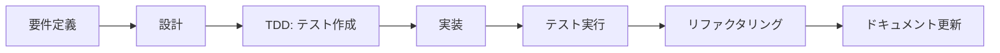

# 👨‍💻 開発者ガイド - Minecraft協調学習システム

## 📋 目次

1. [開発環境のセットアップ](#開発環境のセットアップ)
2. [アーキテクチャ概要](#アーキテクチャ概要)
3. [開発ワークフロー](#開発ワークフロー)
4. [新機能の追加方法](#新機能の追加方法)
5. [テスト戦略](#テスト戦略)
6. [デバッグ手法](#デバッグ手法)
7. [コーディング規約](#コーディング規約)
8. [トラブルシューティング](#トラブルシューティング)

---

## 🛠️ 開発環境のセットアップ

### 必要なツール

1. **Java Development Kit (JDK) 17**
   ```bash
   java -version  # 17以上を確認
   ```

2. **Node.js v24.4.0+**
   ```bash
   node --version  # v24.4.0以上を確認
   npm --version   # 10.7.0以上を確認
   ```

3. **IDE推奨**
   - IntelliJ IDEA (Minecraft Mod開発)
   - Visual Studio Code (Scratch拡張開発)

### 初期セットアップ

```bash
# リポジトリのクローン
git clone https://github.com/your-repo/minecraft-collaboration-project.git
cd minecraft-collaboration-project

# Minecraft Mod依存関係
cd minecraft-mod
./gradlew build

# Scratch拡張依存関係
cd ../scratch-extension
npm install
```

---

## 🏗️ アーキテクチャ概要

### システム構成図

```
┌─────────────────┐         WebSocket          ┌──────────────────┐
│  Scratch 3.0    │ ◄────── Port 14711 ──────► │  Minecraft Mod   │
│   Extension     │                             │  (Forge 1.20.1)  │
└─────────────────┘                             └──────────────────┘
        │                                               │
        └─────────────── Messages ──────────────────────┘
```

### 主要コンポーネント

#### Minecraft Mod側

```
minecraft-mod/src/main/java/com/yourname/minecraftcollaboration/
├── MinecraftCollaborationMod.java      # メインModクラス
├── network/
│   ├── WebSocketHandler.java           # WebSocket接続管理
│   └── CollaborationMessageProcessor.java # メッセージ処理
├── commands/
│   └── CollaborationCommandHandler.java # コマンド実行
├── collaboration/
│   └── CollaborationManager.java       # 協調機能管理
├── entities/
│   ├── CollaborationAgent.java         # エージェントエンティティ
│   └── AgentManager.java               # エージェント管理
├── security/
│   ├── SecurityConfig.java             # セキュリティ設定
│   └── RateLimiter.java               # レート制限
└── util/
    ├── ResponseHelper.java             # レスポンス生成
    └── ValidationUtils.java            # 入力検証
```

#### Scratch拡張側

```
scratch-extension/
├── src/
│   └── index.js                        # メイン拡張コード
├── package.json                        # 依存関係定義
└── webpack.config.js                   # ビルド設定
```

---

## 💻 開発ワークフロー

### 1. 機能開発の流れ



### 2. ブランチ戦略

```bash
# 新機能開発
git checkout -b feature/新機能名

# バグ修正
git checkout -b fix/バグ説明

# ドキュメント更新
git checkout -b docs/更新内容
```

### 3. コミットメッセージ規約

```
<type>: <subject>

<body>

<footer>
```

**Type:**
- `feat`: 新機能
- `fix`: バグ修正
- `docs`: ドキュメント
- `style`: フォーマット
- `refactor`: リファクタリング
- `test`: テスト
- `chore`: ビルド・ツール

**例:**
```
feat: Add agent follow command

Implement agent follow functionality that allows agents to
follow their owner player automatically.

Closes #123
```

---

## ➕ 新機能の追加方法

### 1. 新しいScratchブロックの追加

#### Step 1: Scratch拡張でブロック定義

```javascript
// scratch-extension/src/index.js
getInfo() {
    return {
        blocks: [
            // 既存のブロック...
            {
                opcode: 'myNewBlock',
                blockType: BlockType.COMMAND,
                text: '新しい機能 [PARAM]',
                arguments: {
                    PARAM: {
                        type: ArgumentType.STRING,
                        defaultValue: 'default'
                    }
                }
            }
        ]
    };
}

// ハンドラーメソッド追加
myNewBlock(args) {
    this.sendCommand('myNewCommand', {
        param: args.PARAM
    });
}
```

#### Step 2: メッセージプロセッサーでルーティング

```java
// CollaborationMessageProcessor.java
private String routeJsonCommand(String command, Map<String, String> args) {
    switch (command) {
        // 既存のケース...
        case "myNewCommand":
            return handleMyNewCommand(args);
    }
}

private String handleMyNewCommand(Map<String, String> args) {
    String param = args.get("param");
    // 処理実装
    return ResponseHelper.success("myNewCommand", "Executed successfully");
}
```

#### Step 3: コマンドハンドラーで実装

```java
// CollaborationCommandHandler.java
public String handleMyNewCommand(String[] args) {
    try {
        // 入力検証
        if (args.length < 1) {
            return ResponseHelper.error("myNewCommand", 
                ResponseHelper.ERROR_INVALID_PARAMS, "param required");
        }
        
        // ビジネスロジック
        MinecraftServer server = ServerLifecycleHooks.getCurrentServer();
        // 実装...
        
        return ResponseHelper.success("myNewCommand", "Success");
    } catch (Exception e) {
        LOGGER.error("Error in myNewCommand", e);
        return ResponseHelper.error("myNewCommand", 
            ResponseHelper.ERROR_INTERNAL, e.getMessage());
    }
}
```

### 2. 新しいエンティティの追加

```java
// 1. エンティティクラス作成
public class MyNewEntity extends PathfinderMob {
    // 実装
}

// 2. ModEntitiesに登録
public static final RegistryObject<EntityType<MyNewEntity>> MY_ENTITY = 
    ENTITIES.register("my_entity", () -> 
        EntityType.Builder.of(MyNewEntity::new, MobCategory.CREATURE)
            .sized(0.6F, 1.8F)
            .build("my_entity"));

// 3. 属性登録
@SubscribeEvent
public static void registerAttributes(EntityAttributeCreationEvent event) {
    event.put(MY_ENTITY.get(), MyNewEntity.createAttributes().build());
}
```

---

## 🧪 テスト戦略

### 1. テストの種類

#### ユニットテスト
```java
// 例: RateLimiterTest.java
@Test
public void testRateLimit() {
    RateLimiter limiter = RateLimiter.getInstance();
    
    // 10回は成功
    for (int i = 0; i < 10; i++) {
        assertTrue(limiter.allowCommand("test-user"));
    }
    
    // 11回目は失敗
    assertFalse(limiter.allowCommand("test-user"));
}
```

#### 統合テスト
```java
// 例: CollaborationIntegrationTest.java
@Test
public void testInvitationFlow() {
    Invitation invitation = manager.createInvitation("Player1", "Player2");
    
    List<Invitation> invitations = manager.getInvitationsForPlayer("Player2");
    assertEquals(1, invitations.size());
    
    manager.acceptInvitation(invitation.getId());
    assertEquals(InvitationStatus.ACCEPTED, invitation.getStatus());
}
```

#### E2Eテスト
```java
// 例: WebSocketE2ETest.java
@Test
public void testWebSocketConnection() throws Exception {
    WebSocketClient client = new WebSocketClient(new URI("ws://localhost:14711"));
    client.connectBlocking();
    
    assertTrue(client.isOpen());
    
    // コマンド送信とレスポンス確認
    client.send("{\"command\":\"getPlayerPos\",\"args\":{}}");
    // アサーション...
}
```

### 2. テスト実行

```bash
# Minecraft Modテスト
cd minecraft-mod
./gradlew test

# 特定のテストクラス実行
./gradlew test --tests "*RateLimiterTest"

# Scratch拡張テスト
cd scratch-extension
npm test
```

---

## 🐛 デバッグ手法

### 1. ログ出力

```java
// SLF4Jロガー使用
private static final Logger LOGGER = MinecraftCollaborationMod.getLogger();

// デバッグログ
LOGGER.debug("Processing command: {} with args: {}", command, args);

// エラーログ
LOGGER.error("Failed to process command", exception);
```

### 2. 開発環境でのデバッグ

```bash
# デバッグモードでMinecraft起動
./gradlew runClient --debug-jvm

# IntelliJ IDEAでアタッチ
# Run > Attach to Process > Minecraft Client
```

### 3. WebSocket通信のデバッグ

```javascript
// Chrome DevTools使用
// 1. F12でDevTools開く
// 2. Networkタブ > WS
// 3. WebSocket通信を監視

// Node.jsデバッグクライアント
const ws = new WebSocket('ws://localhost:14711');
ws.on('message', data => console.log('Received:', data));
```

---

## 📝 コーディング規約

### Java (Minecraft Mod)

1. **命名規則**
   - クラス名: PascalCase
   - メソッド名: camelCase
   - 定数: UPPER_SNAKE_CASE

2. **インデント**: スペース4つ

3. **エラーハンドリング**
```java
try {
    // 処理
    return ResponseHelper.success(command, result);
} catch (SpecificException e) {
    LOGGER.error("Specific error in " + command, e);
    return ResponseHelper.error(command, ERROR_CODE, e.getMessage());
} catch (Exception e) {
    LOGGER.error("Unexpected error in " + command, e);
    return ResponseHelper.error(command, ERROR_INTERNAL, "Internal error");
}
```

### JavaScript (Scratch拡張)

1. **命名規則**
   - 変数・関数: camelCase
   - 定数: UPPER_SNAKE_CASE

2. **非同期処理**
```javascript
async sendCommand(command, args) {
    try {
        const response = await this.websocket.send(JSON.stringify({
            command,
            args
        }));
        return response;
    } catch (error) {
        console.error('Command failed:', error);
        throw error;
    }
}
```

---

## 🔧 トラブルシューティング

### よくある問題

#### 1. WebSocket接続エラー
```
原因: ポート14711が使用中
解決: 
- netstat -an | grep 14711 で確認
- 別プロセスを終了するか、ポート変更
```

#### 2. ClassNotFoundException
```
原因: jarJar設定の問題
解決:
- build.gradleのjarJar設定確認
- ./gradlew clean build で再ビルド
```

#### 3. Gradle依存関係エラー
```
解決:
./gradlew --refresh-dependencies
./gradlew clean build
```

### デバッグチェックリスト

- [ ] Javaバージョンは17以上か？
- [ ] Node.jsバージョンは24.4.0以上か？
- [ ] WebSocketポート(14711)は開いているか？
- [ ] ファイアウォール設定は適切か？
- [ ] 必要な依存関係はインストールされているか？

---

## 📚 参考資料

- [Minecraft Forge Documentation](https://docs.minecraftforge.net/)
- [Scratch Extension Documentation](https://github.com/LLK/scratch-vm/wiki/Extensions)
- [WebSocket Protocol RFC 6455](https://tools.ietf.org/html/rfc6455)
- [Project API Reference](../API_REFERENCE.md)

---

## 🤝 コントリビューション

1. Issueを作成して議論
2. フォークしてブランチ作成
3. テストを含む実装
4. プルリクエスト作成
5. コードレビュー
6. マージ

---

最終更新: 2025年7月26日